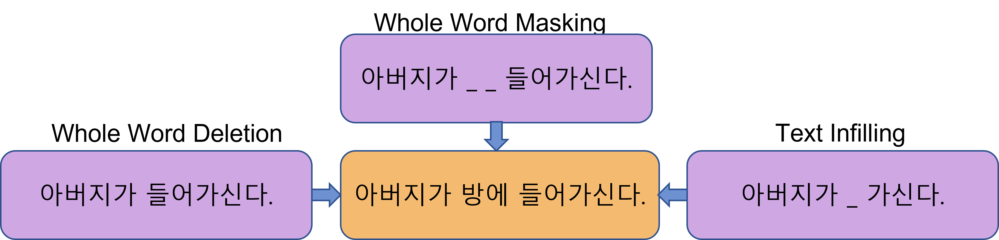

# HanBART
HanBART는 BART 모델을 한국어와 영어 코퍼스를 이용하여 사전학습한 모델입니다.  
Vocabulary는 자체 개발한 moran tokenizer에서 추출된 token을 포함하여 54000개의 sub-word token으로 이루어져있습니다.  
사전학습에 사용된 corpus는 55G를 사용하였으며,  
[**BART**](https://arxiv.org/pdf/1910.13461.pdf)(**B**idirectional and **A**uto-**R**egressive **T**ransformers)원문에서 사용하던 함수를 변경하여 3개를 사용했습니다.  
사용한 노이즈 함수는 whole word masking, whole word deletion, token infilling입니다.



## 학습모델
학습된 요약모델은 다음의 경로에서 받을 수 있습니다.
```
wget --load-cookies /tmp/cookies.txt "https://docs.google.com/uc?export=download&confirm=$(wget --quiet --save-cookies /tmp/cookies.txt --keep-session-cookies --no-check-certificate 'https://docs.google.com/uc?export=download&id=148GgCLRfTeEs9EbqIXB7GRwVw1lM0mba' -O- | sed -rn 's/.*confirm=([0-9A-Za-z_]+).*/\1\n/p')&id=148GgCLRfTeEs9EbqIXB7GRwVw1lM0mba" -O hanBART_model.tar && rm -rf /tmp/cookies.txt
tar xfv hanBART_model.tar
```

```
```

## Data
사용한 데이터는  AI-Hub에 있는 문서요약 텍스트의 신문기사 1.3G의 데이터를 사용했습니다.
train set - 271093건
valid set - 30122건


## Tokenizer 
Tokenizer는 Hanbert Tokenizer에서 가져왔습니다.
```
$ wget --load-cookies /tmp/cookies.txt "https://docs.google.com/uc?export=download&confirm=$(wget --quiet --save-cookies /tmp/cookies.txt --keep-session-cookies --no-check-certificate 'https://docs.google.com/uc?export=download&id=1PTeLxreXgjobVF5zhwDKu3RNuPw3qFbY' -O- | sed -rn 's/.*confirm=([0-9A-Za-z_]+).*/\1\n/p')&id=1PTeLxreXgjobVF5zhwDKu3RNuPw3qFbY" -O hanbert_tokenizer.tar && rm -rf /tmp/cookies.txt
$ tar xvf hanbert_tokenizer.tar

from tokenization_hanbert import HanBertTokenizer
tokenizer = HanBertTokenizer.from_pretrained('HanBart-54kN')
```

## 학습
d
학습을 위한 파라미터들은 configuration/train.yml 파일에 저장되어 있습니다. 
```
$ python run_finetuning.py
```


